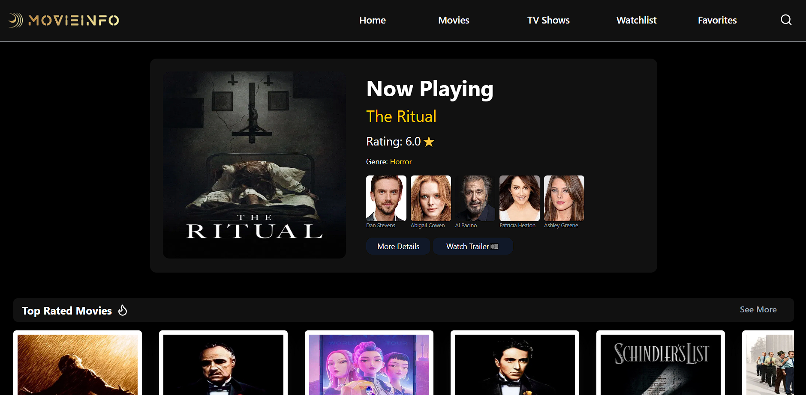
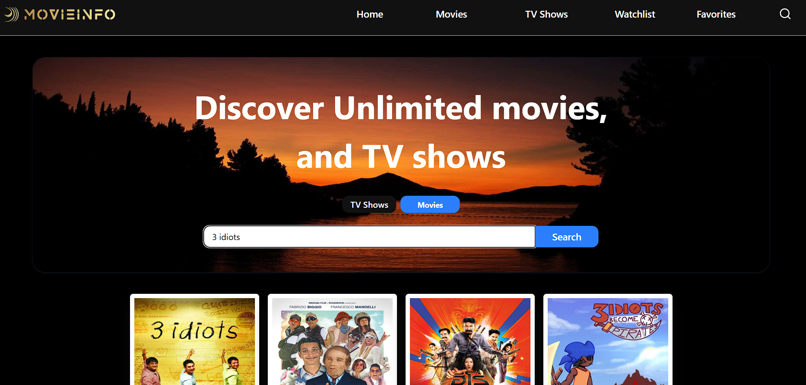

# 🎬 MovieInfo

**MovieInfo** is a sleek and responsive web app that allows users to explore, search, and get detailed information about movies and TV series — all powered by the **TMDb API**.

No ads. No distractions. Just movies and shows — clean and simple.

### 🔗 Live Demo
👉 [movieinfo24.vercel.app](https://movieinfo24.vercel.app)

---

## ✨ Features

- 🎞️ **Now Playing** – See what’s currently in theatres
- ⭐ **Top Rated** – Explore critically acclaimed titles
- 📈 **Trending** – Stay up-to-date with daily/weekly trends
- 🌍 **Popular Picks** – Discover what the world is watching
- 🔎 **Powerful Search** – Instantly find any movie or TV show
- 📚 **Detailed Info** – View cast, ratings, release date, plot, etc.
- 📱 **Responsive Design** – Seamlessly works on all screen sizes

---

## 💡 Purpose

To create a fast, clutter-free, and elegant platform for movie and TV discovery that is accessible to everyone — without requiring logins or subscriptions.

---

## 🛠️ Tech Stack

| Part        | Technology       |
|-------------|------------------|
| Frontend    | React.js         |
| Styling     | Tailwind CSS     |
| Data Source | TMDb API         |
| Hosting     | Vercel           |

---

## 📸 Screenshots

### 🏠 Home Page

### 🔍 Search Page

### 🎬 Movie Details

---